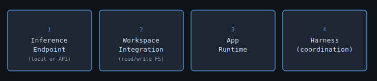
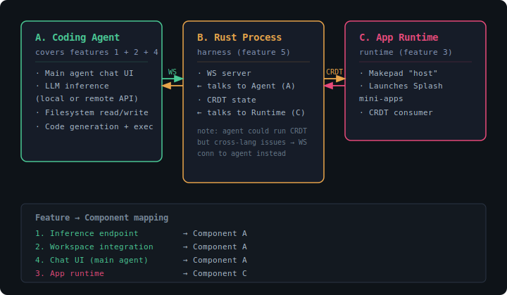

# A2App: Agentic App Building and Runtime System

A2App is a system for building and running agentic applications. It composes an inference endpoint, a shared workspace, an app runtime, and a coordination harness into a coherent whole.

---

## Key Features

Four capabilities define the system, independent of any particular implementation:

---

## Reference Implementation

One concrete way to implement A2App maps the four features onto three components:

---

## Component Notes

**A — Coding Agent** handles both inference (feature 1) and workspace access (feature 2). It runs the LLM loop, reads and writes the filesystem, and communicates outward via a WebSocket connection to the Rust process.

**B — Rust Process** is the harness (feature 4). It runs a WebSocket server that the coding agent connects to, and maintains a CRDT for state synchronisation with the app runtime. The CRDT could in principle live in the coding agent, but cross-language friction made a WebSocket bridge the pragmatic call.

**C — App Runtime** covers the runtime (feature 3). It hosts a Makepad application shell capable of launching Splash mini-apps, and consumes state from the Rust process via the CRDT.

---

## Session: Progressive Splash App Testing (2026-07-09)

This session exercised the full a2app stack through five increasingly sophisticated apps. The complete log (prompts, tool calls, model responses, rendered UIs) is available at [app_gen.jsonl](https://huggingface.co/datasets/gterzian/a2app/blob/main/app_gen.jsonl) on Hugging Face.

### 1. Hello World (Static Rendering)

**App:** A dark-themed greeting label. Confirmed that the Makepad Host renders Splash DSL without errors and the orphan widget coordinates align with the window-relative coordinate system documented in AGENTS.md.

### 2. Interactive Counter (Stateful Variables + Click Handling)

**App:** `counter-simple` — +/-/Reset buttons, a live display label, and a "Send to Pi" button that calls `__pi_response.set_text()`.

**Verified capabilities:**
- `let` variable persistence across click events
- Click dispatch via `check_debug_app` (window-relative orphan coordinates)
- Splash → Pi communication (`__pi_response.set_text("count:1")` → doc `user_response: "count:1"`)
- **Layout constraint:** `View{flow:Right}` causes `dy.is_nan()` in Makepad's turtle layout. Use direct orphans with `flow:Down` only.

### 3. Todo List (TextInput + Dynamic List)

**App:** `todo-1` — TextInput for adding items, dynamic list rendered via `while` loop over a struct array, "Remove Last" and "Send to Pi" buttons.

**Verified capabilities:**
- `type_text` fills the first TextInput in the splash body
- `while idx < items.len()` correctly indexes into struct arrays (Splash VM gotcha: `for i in items` iterates values not indices)
- `items.push()`, `items.remove()` mutate array state
- Dynamic `set_text()` on Label updates visible list content
- `__pi_response.set_text(ui.lst.text())` sends multi-line list content back to pi

### 4. AI Chat (Sub-Agent Inference with Streaming)

**App:** `chat-ai-1` — Launched with `launch_app_with_agent`. Splash body sends `ai:ask:What is a CRDT?` via `__pi_response.set_text()`. The auto-handler routes to a blank-slate DeepSeek V4 Flash sub-agent.

**Verified capabilities:**
- `ai:ask:` protocol — splash → auto-handler → sub-agent → streaming deltas → splash
- Streaming response appears token-by-token in the injected `__ai_text` Label
- `__pi_data` receives the final response on completion
- `splash_holder` height grows to accommodate response text
- The sub-agent is isolated (blank slate) — no inherited system prompt or project context

### 5. Splash Generator (Meta — AI Generates Subsplash UI)

**App:** `splash-gen-1` — A TextInput for prompts and a "Generate Splash" button that sends `ai:ask:a simple counter with + and - buttons`. The sub-agent was seeded with a system prompt teaching correct Splash DSL syntax (no commas, `:=` naming, `on_click:||{}`, `width:Fill`, etc.).

**Verified capabilities:**
- Sub-agent produces valid Splash DSL inside `\`\`\`runsplash` code blocks
- The nested `__run_splash` AgentSplash (injected into every splash body) evaluates and renders the generated code inline
- `__run_splash` height grew from **0 to 286px** — the generated counter UI (RoundedView with display, -, + buttons) rendered inside the parent chat app
- `__pi_status` shows "⚙ Generating..." during streaming
- Error recovery: `set_text()` restores previous valid body on eval failure

**System prompt strategy:** Teaching the AI with exactly one correct example (the counter from level 2) produced valid syntax on the first attempt — no commas, proper `:=`, correct `on_click:||{}`, `"" + count` for number conversion.

### Known Limitations Encountered

| Issue | Workaround |
|-------|------------|
| `View{flow:Right}` → `dy.is_nan()` crash | Use `flow:Down` with direct orphan children |
| Nested AgentSplash (`__run_splash`) can cause NaN on re-layout | `set_text()` has error recovery; partial code during streaming silently keeps last working UI |
| `while` loops can cause debug system timeouts with rapid clicks | Allow 10s+ cooldown between interactions |
| `widget_snapshot` shows nested AgentSplash wrapper but not its children | Children are in the VM's widget tree, separate from the main tree |

### Session Data

The full session log (including all tool calls, model responses, doc states, and rendered outputs) is recorded at [app_gen.jsonl](https://huggingface.co/datasets/gterzian/a2app/blob/main/app_gen.jsonl). Each entry includes:
- `type: "message"` — user prompts and assistant responses with full tool call chains
- `type: "model_change"` — model provider/config at each stage
- `type: "session"` — session metadata (timestamp, working directory)
- Screenshots in `artifacts/` capture the rendered state of each app