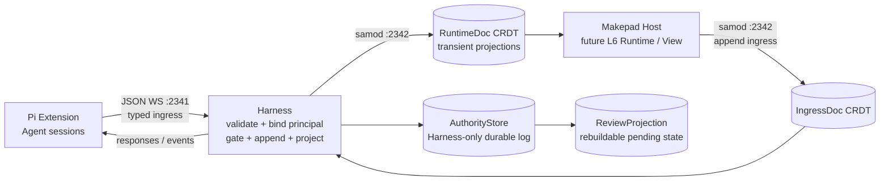

# A2App Harness：CFP + CRDT 演进计划

> 状态：提案
>
> 目标分支：`docs/cfp-crdt-evolution-plan`
>
> 基线：`main@f6f14b2`
>
> 参考：CFP v0.3、Makepad `dev@008b2eb2` 中的 `examples/aichat-agent2app` P3 方案

## 1. 结论先行

A2App Harness 不应在“CRDT”与“CFP”之间二选一。两者解决的问题位于不同层：

- **CRDT / samod** 是复制与并发收敛机制，回答“多个 Rust 进程怎样共享、合并状态”。
- **CFP** 是内容语义、权限、审查与可追溯协议，回答“某条内容是什么、谁可以执行、为什么执行、如何审查”。
- **JSON WebSocket** 继续承担 Pi 扩展与 Harness 之间的传输；CFP 不要求替换传输协议。
- **Makepad / Splash** 继续作为未来 CFP L6 Native Runtime/View 的落点；在内容尚未由 CFP 对象图派生前，它只是 CFP-inspired runtime，视图不是事实权威。

推荐采用 **CFP-inspired 本地 profile（下文简称 CFP-lite）分阶段演进**：先把现有字符串约定提升为带版本、类型和能力声明的消息；再建立追加式运行事件、fail-closed 权限门禁和持久 ReviewChain；最后以最小 Claim/Commitment/AppBundle 进入 CFP v0.3 合规轨道。P0–P4 的 CFP-lite 是 closed-world 本地协议，**不宣称兼容 CFP v0.3**；首期也不把每个流式 token 写入永久事件日志。

这条路线保留当前系统已经验证的低复杂度边界，同时解决现有 CRDT 单文档“既当状态、又当命令、还隐含权限”的结构性问题。

## 2. 当前系统基线

### 2.1 三进程边界

当前架构由三部分组成：

1. Pi Coding Agent：维护扩展侧会话和本地状态，通过 2341 端口发送普通 JSON WebSocket 消息，不参与 CRDT。
2. Rust Harness：创建 samod 文档，接收 Pi 消息，启动 Makepad Host，并在 JSON 消息与共享文档之间桥接。
3. Makepad Host：通过 2342 端口与 Harness 同步 CRDT 文档，持有 `DocHandle`，渲染 `AgentSplash`，将用户交互写回文档。

这一边界是合理的。把 TypeScript 扩展排除在 CRDT 之外，避免了跨语言 CRDT 实现、schema 演进和同步生命周期的额外成本。CFP 演进不应破坏这一点。

### 2.2 当前共享文档的职责

`shared/src/lib.rs` 中的 `AgentDoc` 同时容纳：

- 应用生命周期：`pending_app`、`should_exit`、`extension_requests`；
- 用户和 Agent 消息：`user_response`、`pi_response`；
- 流式显示：`streaming_text`；
- 调试命令与结果：`debug_command`、`debug_response`；
- 错误和崩溃信息：`error_message`、`panic_backtrace`；
- 同值消息检测：`user_response_version`。

它更接近一个可复制的“当前状态 + 单槽邮箱”，而不是 CFP L1 所要求的不可变、追加式事件历史。`user_response_version` 解决了同值更新检测，却没有提供稳定事件身份、因果关系、重放语义或幂等键。字段被覆盖或清空后，历史事实随之消失。

### 2.3 当前交互协议

Splash 通过隐藏控件传递消息：

- `__pi_response`：Splash 写字符串，Host 观察变化后写入 CRDT；
- `__pi_data`：Pi 的最终响应由 Host 写入，Splash 读取；
- `__ai_text`：展示流式或最终 AI 文本；
- `ai:init:`、`ai:ask:`：扩展侧用字符串前缀识别意图。

这种方式适合快速验证，但协议语义分散在 Splash、Host、Harness 和 TypeScript 扩展中。未知前缀、参数编码、权限等级、重试与重复交付都缺少统一契约。

### 2.4 当前 CRDT 使用方式的优点与限制

优点：

- Harness 与 Host 都使用 Rust/samod，技术栈一致；
- 文档变化天然唤醒 Makepad 主线程，适合异步状态同步；
- 在 Harness 仍存活且内存文档未丢失时，Host 重连可重新获得当前状态；
- 正常同步由 Signal 驱动；当前流式活跃期间仍存在 Draw fallback，会 hydrate 文档，后续需要移除或限频。

限制：

- 当前状态是权威，历史不可重放；
- 命令、状态、审查结果混在同一 schema；
- 字段清空兼具“已消费”和“无值”两种语义；
- 当前没有权威权限判断：扩展仅以字符串前缀路由 AI 业务消息，Harness 对合法 JSON enum 直接处理；
- 缺少事件 ID、请求 ID、父事件、actor、时间和协议版本；
- CRDT 只在内存中，进程重启后审查与执行证据丢失。

## 3. 与 makepad-dev agent2app P3 的区别

`makepad-dev` 的 `examples/aichat-agent2app` P3 已引入 CFP 风格的权限词汇与交互门禁：

- `PermissionLevel` 区分 `ReadOnly`、`AutoExecutable`、`RequiresConfirmation` 与 `Forbidden`；
- 静态 manifest 为已知 action 声明权限，未知 action 默认拒绝；
- 分派状态机把交互划分为执行、停放等待确认、丢弃或拒绝；
- `ask_ai` 进入确认路径，文件写入等能力可被禁止；
- Makepad 侧通过 `agent.notify` 抛出交互，再由宿主统一处理。

但 P3 有意只采用 CFP 词汇和门禁思想，并未实现完整 CFP runtime、typed claims、L1 事件溯源或持久 ReviewChain。它的定位是**单进程 UI 交互治理样例**；A2App Harness 则是**三进程、跨 WebSocket、带 CRDT 同步和后台 Agent 会话的运行系统**。

两者关键差异如下：

| 维度 | A2App Harness 当前方案 | makepad-dev agent2app P3 | 本计划目标 |
| --- | --- | --- | --- |
| 进程模型 | Pi / Harness / Host 三进程 | 单个 Makepad 应用为主 | 保留三进程边界 |
| UI → Host | 隐藏 Label + 字符串前缀 | `agent.notify` | typed `agent.notify` envelope |
| 权限模型 | 分散、隐式 | 静态 manifest，未知默认禁止 | Harness 权威门禁 + 可版本化 manifest |
| CRDT | samod 当前状态文档 | 无 CRDT 核心要求 | 运行态 + 追加式事件日志/投影 |
| Review | 无持久审查链 | 内存确认卡/状态机 | 可恢复、可审计 ReviewChain |
| CFP 范围 | 尚未显式采用 | vocabulary-only P3 | CFP-inspired 本地 profile，逐步进入 CFP 合规轨道 |
| 流式输出 | CRDT `streaming_text` + mpsc | 示例内本地状态 | 保持瞬态，不逐 token 入永久日志 |

因此，不能直接用 agent2app P3 替换现有 CRDT，也不应把 CFP 等同于权限枚举。P3 最值得复用的是 `agent.notify`、静态能力 manifest、fail-closed 默认值和纯状态机测试；Harness 需要在此基础上增加跨进程事件身份、投影、重放和持久审查。

## 4. 目标分层架构



权威数据流固定为：

`Host/Pi 输入 → typed ingress → Harness 校验并绑定 principal → capability gate → AuthorityStore → RuntimeDoc / ReviewProjection`

物理上拆分为四个边界。CRDT 负责 IngressDoc 与 RuntimeDoc 的同步，但不提供 ACL、不可变性或只追加保证；因此 Host 可写的 samod 文档不能充当权威审计存储。

### 4.1 RuntimeDoc：可覆盖的瞬态投影

用于渲染和进程协调，允许覆盖或清空：

- 当前 app 与 Splash body 的渲染投影；
- `streaming_text` 与 UI 增量显示；
- 调试请求的当前执行状态；
- 连接、ready、shutdown 等运行标志；
- 最后一次错误的展示投影；
- 已确认事件投影出的 `pi_response` / `user_response` 兼容字段。

它继续由 samod 同步并可只存在内存。RuntimeDoc 不是审计记录，也不承担“发生过什么”的最终证明。关键业务与治理状态可从 AuthorityStore 重建；流式显示、连接状态等运行态则允许丢失。

### 4.2 IngressDoc：不可信输入邮箱

Host 只向 IngressDoc 追加 `NotifyInboxItem` 与 `ReviewResponseInboxItem`。每项必须包含稳定 ingress ID、请求 ID、app ID、payload 和客户端声明的 `claimed_actor`。Harness 负责：

- 将连接、spawn token、session 与 UI 通道绑定为可信的本地 `transport_principal`；
- 将 `claimed_actor` 仅作为展示信息，禁止直接参与授权；
- 原子地完成 ingress 去重、权威事件追加和 ack cursor 更新；
- 对已 ack 项按保留窗口 GC；未 ack 项允许重放。

如果 samod 不能对远端执行只写/只读 ACL，这个边界只提供协议隔离而非安全隔离。Harness 必须把所有 IngressDoc 内容视为可伪造输入。

### 4.3 AuthorityStore 与 RuntimeEventLog：仅 Harness 可写的事实源

AuthorityStore 位于 Host 不可写、也不通过同一可写 CRDT 文档同步的进程外持久存储中。它保存追加式 `RuntimeEventLog`、去重索引、execution ledger、snapshot 元数据和 reducer 版本。`RuntimeEventLog` 用于记录具有业务或治理意义的运行事实：

用于记录具有业务或治理意义的事实：

- 应用发布、清理、关闭；
- 用户意图和 `agent.notify`；
- Agent 请求开始、完成、失败或取消；
- 状态迁移与最终输出；
- 能力门禁结果；
- 审查请求与审查决定；
- 执行结果、错误摘要和可选证据引用。

事件只追加，不原地修改。Harness 在同一持久提交边界内完成去重检查、分配 `log_seq` 和 append；`event_id` 是全局身份，`log_seq` 是单一权威写者接纳后的本地全序。孤儿父事件默认拒绝并记录脱敏原因，不以 CRDT 顺序推断业务全序。生产配置使用进程锁或 fencing 防止两个 Harness 同时成为权威写者。

长期日志不存入单个无限增长的 Automerge 文档；采用外部追加存储或 sealed chunks，RuntimeDoc 只暴露 head cursor、snapshot 和内容引用。开发 profile 可以使用内存 AuthorityStore，但不得通过 P4 recovery 验收。

这些运行事件尚不是 CFP v0.3 L1 Event：在 P5 引入 Claim/Commitment/CfpUri 锚点前，它们只属于 CFP-inspired 本地 profile。

### 4.4 ReviewProjection：由事件派生的审查状态

`RequiresConfirmation` 不应只是内存中的弹窗。每次审查需要稳定 ID，并记录：

- 被审查的 action、参数摘要和能力；
- proposer / reviewer actor；
- `propose`、`approve`、`reject`、`defer`、`withdraw` 等步骤；
- 决定所依据的 manifest 版本；
- 过期时间、父事件和最终执行事件；
- 参数完整性哈希，防止“审查 A、执行 B”。

ReviewChain 的 propose/approve/reject/defer/withdraw/expire 都是 RuntimeEventLog 中的权威事实；`ReviewProjection` 只是可删除、可重建的 materialized view，不是第二份事实源。并发 approve/reject 以首个进入权威 `log_seq` 的终态为准，后续决定记录为 ignored/conflict。

Harness 是门禁和事件追加的权威所有者；Makepad Host 只呈现 ReviewProjection 并上报用户决定；Pi 扩展不能通过直接发送执行消息绕过门禁。P4 起生产 profile 必须落盘 AuthorityStore，真正终止并重启 Harness 后仍能重建 pending review。

## 5. CFP-lite 协议草案

### 5.1 通用 envelope

Pi ↔ Harness 与 Host → Harness 的新消息共享最小 envelope：

```json
{
  "protocol": "cfp-lite/0.1",
  "event_id": "01J...",
  "request_id": "01J...",
  "parent_event_id": null,
  "app_id": "todo-1",
  "claimed_actor": { "kind": "user", "id": "local-user" },
  "type": "interaction.proposed",
  "action": "agent.ask",
  "payload": { "message": "summarize this" },
  "created_at": "2026-07-11T10:00:00Z"
}
```

首期字段约束：

- `protocol` 必填并参与版本协商；
- `event_id` 全局稳定，用于幂等和追踪；
- `request_id` 关联一次端到端请求及其所有流转；
- `parent_event_id` 表达直接因果；
- `claimed_actor` 只表达客户端声明；Harness 依据连接/session 生成的 `transport_principal` 才能参与本地授权；两者都不等同于 CFP Identity 或不可抵赖身份；
- `action` 必须在 capability manifest 中存在；
- `payload` 按 action schema 校验，不能只检查前缀；
- `created_at` 用于展示和诊断，事件顺序以追加序号/因果关系为准，不能只依赖墙上时钟。

### 5.2 Capability manifest

P2/P3 的 manifest 只使用随 Harness 发布、内容哈希固定的静态数据；P5 才允许 AppBundle 提供更窄的 bundle-scoped manifest，且只能收紧内置上限，不能覆盖为更高权限：

```json
{
  "manifest_version": "1",
  "actions": {
    "agent.ask": { "permission": "RequiresConfirmation" },
    "agent.session.init": { "permission": "RequiresConfirmation" },
    "ui.counter.increment": { "permission": "AutoExecutable" },
    "host.debug.snapshot": { "permission": "ReadOnly" },
    "fs.write": { "permission": "Forbidden" }
  }
}
```

规则：

1. CFP-lite 采用 closed-world profile：未进入 action registry 的输入视为无效并拒绝；这是继承 makepad-dev P3、比 CFP v0.3 通用默认值更严格的本地边界。
2. 对已经合法建模但没有显式 permission 的最小 ExecutionIntent，默认 `RequiresConfirmation`，与 CFP v0.3 默认语义一致。
3. manifest 内容哈希随 gate decision 写入事件日志；pending review 期间 manifest 或绑定参数变化时必须重新 gate、重新审查。
4. `ReadOnly` 只允许无状态修改、无外部副作用的查询执行器；`AutoExecutable` 仍需 payload schema、capability scope、app/principal scope、rate limit 和资源预算校验。
5. `RequiresConfirmation` 只能产生 Park/Review 事件，不能直接调用 dispatcher；`Forbidden` 记录拒绝事件，但不得把敏感 payload 原文写入日志。

CFP-lite 在 gate 前把 action 与 canonical payload 固化为不可变 `ExecutionIntent`。Review subject 绑定其 ID，并以 canonical JSON/CBOR 哈希覆盖 action、payload、app、bundle/version、manifest content hash、requester principal 与 expiry。P5 再把 `ExecutionIntent` 映射为带 `CfpUri`、ClaimRef 和 CommitmentRef 的 CFP 对象。

### 5.3 Legacy 兼容映射

迁移期继续支持现有协议，由 Harness/扩展适配为 CFP-lite 事件：

| Legacy 输入 | CFP-lite action / event |
| --- | --- |
| `ai:init:<prompt>` | `agent.session.init` / `interaction.proposed` |
| `ai:ask:<message>` | `agent.ask` / `interaction.proposed` |
| `launch` | `app.launch` / `command.received` |
| `clear` | `app.clear` / `command.received` |
| `debug` | `host.debug.<command>` / `interaction.proposed` |
| `send_streaming_end` | `agent.response.completed` |

原始 `send_streaming_delta` 只更新 RuntimeDoc；MVP 不记录 token checkpoint，只把开始、最终完成、取消和失败写入 RuntimeEventLog。

## 6. 建议的数据模型

Rust 侧先以独立 schema 表达职责，避免继续扩张一个扁平 `AgentDoc`。以下是概念模型，不暗示所有结构都存入同一 samod 文档：

```rust
pub struct RuntimeDoc {
    pub schema_version: u32,
    pub runtime: RuntimeState,
    pub review_projection: Vec<ReviewView>,
    pub authority_head: Option<EventCursor>,
}

pub struct IngressItem {
    pub ingress_id: String,
    pub request_id: String,
    pub app_id: String,
    pub claimed_actor: Option<ClaimedActor>,
    pub action: String,
    pub payload: serde_json::Value,
}

pub struct RuntimeEvent {
    pub log_seq: u64,
    pub event_id: String,
    pub request_id: String,
    pub parent_event_id: Option<String>,
    pub app_id: String,
    pub principal: TransportPrincipal,
    pub kind: EventKind,
    pub action: Option<String>,
    pub payload: TypedEventPayload,
    pub manifest_hash: Option<String>,
    pub created_at: String,
}

pub struct ExecutionLedgerEntry {
    pub execution_id: String,
    pub intent_hash: String,
    pub state: ExecutionState,
    pub result_ref: Option<String>,
}
```

Wire boundary 可以接收 `serde_json::Value`，但通过 schema 校验与 gate 后必须转换为版本化 Rust enum/typed payload，dispatcher 不再解释裸 JSON。

RuntimeDoc 与 IngressDoc 可分别使用 samod 文档；AuthorityStore 则必须是 Harness-only 的持久边界。Host 写入 ingress 后等待 ack；Harness 原子地去重并追加权威事件，再推进 ack cursor。AuthorityStore 中的 `ReviewView` 不存在，ReviewProjection 始终由 `review.*` 事件重建。

外部副作用使用稳定 `execution_id` 和持久 execution ledger/outbox，记录 `ExecutionRequested → DispatchStarted → ResultObserved`。执行器自身支持幂等键时可达到 effectively-once；对于不可幂等的外部系统，只承诺 at-least-once，并提供人工 reconcile，不能仅凭 `event_id` 宣称“一次生效”。

流式投影按请求隔离为 `{app_id, request_id, stream_epoch, revision, text, terminal}`。final 后拒绝旧 epoch 的迟到 delta；mpsc 与 CRDT 两条路径按 revision 合并，避免重复显示。

## 7. 分阶段实施路线

P0–P4 构成 CFP-lite MVP；P5 是进入 CFP 可移植内容模型的后续里程碑；P6 明确延期。建议统一使用 `A2APP_CFP_PROFILE=observe|shadow|enforce`，协议 fixtures 放入 `shared/tests/fixtures/cfp_lite/`，Rust 验证入口为 `cargo test --workspace`，TypeScript 验证入口沿用扩展现有 test/build 命令并检查 source 与 `dist/` 一致。

### P0：冻结契约与建立测试夹具

目标：在改变行为前，记录现有消息流和兼容边界。

工作项：

- 在 `shared` 定义 `cfp-lite/0.1` envelope、action 名称、错误码与可替换 `EventSink` 接口；
- 为现有 JSON WS 消息建立 golden fixtures；
- 记录 Legacy → CFP-lite 映射与协议版本协商规则；
- 为相同 `event_id`、乱序、重连、重复投递建立测试样例；
- 明确敏感字段的日志脱敏规则。

完成门禁：现有 launch、clear、debug、AI streaming、shutdown 流程在兼容模式下行为不变；协议 fixture 可由 Rust 和 TypeScript 同时解析。

### P1：引入 typed ingress 与 `agent.notify`

目标：替代 UI 业务消息对隐藏 Label 和字符串前缀的直接依赖。

工作项：

- Splash/Makepad 侧提供 `agent.notify(action, payload)`；
- Host 将 notify 转成含稳定 `ingress_id`、`request_id`、`app_id` 的 IngressDoc item；
- 扩展侧保留 `ai:init:`、`ai:ask:` adapter，但内部统一转为 typed action；
- `__pi_response` 暂不删除，用于旧 Splash body；
- 对 payload 尺寸、递归深度和 action 长度设上限；
- 实现 ack cursor、重放去重与已确认 ingress 的保留窗口 GC。

完成门禁：新旧 UI 都能工作；同一 notify 重放两次只被 EventSink 接纳一次；Host 伪造 `claimed_actor` 不会改变 Harness 绑定的 principal。

### P2：追加式 RuntimeEventLog 与可重建投影

目标：先建立 gate 和 Review 所依赖的权威事件与持久化基础，让“发生过什么”不再依赖可覆盖字段。

工作项：

- 建立仅 Harness 可写的 AuthorityStore、RuntimeEventLog、去重索引和 projection cursor；
- Harness 分配持久 `log_seq`，定义孤儿父事件拒绝规则，并以进程锁/fencing 保证单一权威写者；
- 用 reducer 从事件重建当前 app、请求状态、最终响应和错误投影；
- 保留现有 `AgentDoc` 字段作为迁移期 RuntimeDoc 投影；
- 对长期日志采用 sealed chunks/外部追加存储、snapshot 与 reducer version，避免单一 Automerge 文档无限增长；
- 建立 execution ledger/outbox，但此阶段不扩大可执行 action。

完成门禁：清空 RuntimeDoc 后可从事件恢复关键业务状态；重复输入只 append 一次；snapshot 损坏、cursor 越界与 reducer 升级能 fail closed；Host 尝试改写权威日志无路径可达。

### P3：Harness 权威 capability gate

目标：把 makepad-dev P3 的 fail-closed 门禁提升到跨进程权威边界。

工作项：

- 在 Harness 加载内容哈希固定的内置 capability manifest；
- 将 gate 设计为纯函数：输入 typed ExecutionIntent、transport principal、app scope 和 capability metadata，输出 `Dispatch`、`Park` 或 `Refuse`；
- `ReadOnly` 只进入查询执行器，`AutoExecutable` 进入带 execution ledger 的 dispatcher；
- `RequiresConfirmation` 生成 Park 事件和迁移期 pending projection，不直接执行；
- `Forbidden` 和非法/未知 action 生成脱敏拒绝事件；
- Pi、Host、Legacy adapter 和 debug 的所有执行入口必须经过同一 gate。

完成门禁：直接构造 WebSocket 消息不能绕过权限；纯状态机覆盖四种权限；manifest 切换会使 pending intent 重新 gate；副作用前后 kill Harness 的故障注入能区分安全重试与人工 reconcile。

### P4：持久 ReviewChain

目标：让确认过程可恢复、不可绕过、可审计。

工作项：

- 定义 review proposal、decision、defer、withdraw、expire 事件；
- Makepad Host 从 ReviewProjection 渲染确认卡，并通过 ReviewResponseInbox 提交带 review ID 的决定；
- Harness 以 transport principal 校验 reviewer scope，并校验 canonical intent hash 与 manifest content hash；
- 只有有效 approve 事件才能产生 execution requested；
- 生产/验收 profile 强制使用进程外持久 AuthorityStore，定义 commit/fsync 边界、损坏恢复和 snapshot 校验；
- 真正重启 Harness 后恢复 pending review，过期项自动转为 expired；并发 approve/reject 以首个权威终态为准。

完成门禁：审查前后任一绑定参数变化都拒绝执行；重复 approve 不产生第二条 ExecutionRequested；Pi 直接发送“已批准”字符串无效；Host 与 Harness 分别 kill/restart 后均能正确恢复。

### P5：AppBundle 子集

目标：把应用内容、决策与运行绑定组织成最小可传递单元。

该阶段引入最小 `CfpUri`、ClaimRef 与 CommitmentRef，使 Review subject 和执行证明获得 CFP 对象锚点。AppBundle 建议包含：

- `bundle_id`、`bundle_version`、`parent_version`；
- `user_intent`；
- `claims`、`decisions` 与 `commitments`；
- Splash source 及内容哈希；
- capability manifest；
- runtime binding（Makepad/Splash 版本、入口和资源引用）；
- 创建 principal、claimed actor 与基础 provenance 引用。

AppBundle 不直接保存实时控件状态或流式 token。运行时状态由事件和投影管理，资源大对象通过 content-addressed reference 关联。

完成门禁：同一 bundle 在兼容运行时得到一致能力边界；派生版本能追溯 parent；修改 source 或 manifest 会改变内容哈希。

### P6：可选的完整 CFP 能力

仅在真实互操作需求出现后评估：

- 更完整的 typed claim vocabularies 与 provenance；
- 密码学 actor identity、签名与证明；
- 跨设备多写者事件合并；
- 非 Makepad runtime binding；
- 外部内容寻址存储与长期归档；
- 完整 CFP 七层验证工具链。

这些项目不属于 CFP-lite MVP，不能阻塞 P0–P4；P5 也应由真实互操作需求驱动。

## 8. 组件级改造范围

### `shared`

- 新增协议 envelope、typed ingress/event/review、capability manifest 与 schema version；
- 将 RuntimeDoc、IngressDoc 与 AuthorityStore 接口分型；
- 提供 reducer 和去重逻辑的纯函数测试；
- 保留旧 `AgentDoc` 兼容读取，逐字段迁移。

### `harness/src/main.rs`

- 在 JSON WS 边界完成版本校验与 Legacy adapter；
- 成为 capability gate、RuntimeEventLog 和 ReviewChain 事件的唯一权威写者；
- 绑定 transport principal，不信任客户端 `claimed_actor`；
- 在副作用执行前检查 execution ledger、稳定 execution ID 和有效 approve；
- 从事件生成 Host 所需 RuntimeDoc 业务投影；
- 将协议错误与应用错误分离。

### `makepad-host`

- 接收 RuntimeDoc 投影，正常路径通过 Signal 把后台变化带入 UI 线程，并移除或限频流式 Draw hydrate fallback；
- 将 Splash `agent.notify` 写入 typed inbox；
- 渲染 ReviewProjection，而不自行决定权限或改写权威事件；
- 保留隐藏 widget adapter，标记为 deprecated；
- UI 不直接追加“已执行”事实，只报告用户交互和本地渲染结果。

### `.pi/extensions/makepad`

- `doc-bridge.ts` 支持 CFP-lite envelope 和 request correlation；
- `background-agent.ts` 按 action 分派，移除业务逻辑对裸前缀的依赖；
- `tools.ts` 暴露 typed action，兼容旧工具参数；
- TypeScript source 与 `dist/` 构建产物继续保持同步；
- 流式 delta 按 request/epoch/revision 保持低延迟通道，最终结果由 Harness 生成权威 completion event。

## 9. 一致性、性能与安全约束

### 9.1 一致性

- CRDT 收敛不等于副作用 exactly-once；外部副作用使用持久 execution ledger 与稳定 `execution_id`，不可幂等目标明确为 at-least-once + reconcile。
- 投影 reducer 必须确定性；不能依赖本地时间、随机数或 HashMap 遍历顺序。
- 同一事件可被重复观察，但 AuthorityStore 只允许追加一次 ExecutionRequested；执行器是否一次生效取决于其幂等能力。
- ReviewChain 与 canonical ExecutionIntent、principal、app/bundle、manifest hash 和 expiry 共同绑定。

### 9.2 性能

- 不把 token 级 delta 永久追加到事件日志；流式文本保持 RuntimeDoc 或 mpsc 快路径。
- 目标是 Host 只在 Signal 等必要事件上读取 CRDT；现有流式 Draw fallback 必须移除或限频并纳入性能回归。
- AuthorityStore 使用分段日志、snapshot 和保留策略；API 分页不能解决单一 Automerge 文档的全量同步成本。
- 大段 Splash source、模型输出和资源使用内容哈希引用，事件只保存摘要与引用。

### 9.3 安全

- 未知协议版本、未知 action、缺失 capability 一律拒绝。
- Harness 是唯一权限权威，Host 和扩展都视为不可信输入方；AuthorityStore 不暴露给 Host 可写的 samod repo。
- 日志不保存密钥、完整系统提示、敏感文件内容或未脱敏错误栈。
- debug action 也必须进入 manifest；测试便利不能成为生产旁路。
- AppBundle 的 source 与 manifest 必须共同参与完整性校验。

## 10. 测试矩阵

| 层级 | 核心用例 |
| --- | --- |
| Schema | Rust/TypeScript fixture 互解析、未知版本、缺字段、payload 上限 |
| Gate | 四种权限、未知 action、principal/app scope、manifest 版本切换 |
| Event | 重复 ID、孤儿父事件、断线重连、snapshot 后重放、单写 fencing |
| Review | approve/reject/defer/withdraw/expire、参数篡改、并发/重复决定 |
| Streaming | delta 不入永久日志、final completion 入日志、迟到 delta、epoch/revision |
| Projection | 从空 RuntimeDoc 重建关键业务态、Legacy 字段一致、确定性 hash |
| Integration | Pi → Harness → Host 和 Host → Harness → Pi 全链路 |
| Recovery | Harness/Host 分别 kill/restart、pending review 恢复、snapshot 损坏 |
| Execution | 副作用前后 kill、幂等执行器重试、不可幂等目标 reconcile |
| Security | 未知 action fail-closed、伪造 actor、Host 篡改权威日志、敏感字段脱敏 |

每一阶段同时保留现有 `HARNESS_HEADLESS=1` smoke test，并增加至少一个真实 samod 双端同步用例。门禁、reducer 和 ReviewChain 优先写成不依赖 UI 的纯逻辑测试；Makepad 交互只验证渲染和事件桥接。

## 11. 发布、回滚与观测

采用双协议、双写投影的渐进迁移：

1. **Observe**：解析 CFP-lite 但只记录比较结果，不改变分派。
2. **Gate shadow**：新 gate 给出决策，与 Legacy 行为对比并报告偏差。
3. **Gate enforce**：对新 action 强制门禁，旧前缀仍走 adapter。
4. **Event authority**：RuntimeDoc 的关键业务态改由 event reducer 生成，旧字段成为投影。
5. **Legacy retire**：连续两个发布版本旧入口计数为零，且 Legacy 兼容回归通过后，分版本移除隐藏 Label 业务协议。

需要暴露最小观测指标：协议版本、消息拒绝原因、重复事件数、pending review 数、投影延迟、CRDT 文档大小、snapshot 时长和副作用幂等命中数。日志只记录 ID、action、状态和脱敏摘要。

回滚时可以关闭 event-authority projection，恢复 Legacy 投影，但 capability gate 一旦进入 enforce 就不得回退为无门禁 dispatcher；Legacy dispatcher 永远位于同一 gate 之后。遇到不兼容版本时暂停新副作用并保留 pending review，不自动批准或执行。已写事件保持只读，不逆向删除；manifest 内容哈希随发布固定，禁止运行中静默改变既有 review 的权限语义。

## 12. 决策与非目标

本计划确认以下决策：

1. 保留 Pi ↔ Harness 的普通 JSON WebSocket，不把 Pi 扩展接入 CRDT。
2. 保留 Harness ↔ Host 的 samod CRDT，但拆分为不可信 IngressDoc 和可覆盖 RuntimeDoc；权威事件不放在 Host 可写的 CRDT 文档中。
3. CRDT 不是 CFP 的替代物；CFP 也不是新的传输或数据库。
4. Harness 与其进程外 AuthorityStore 是权限、事件追加与审查的权威边界。
5. 高频流式 delta 属于瞬态运行数据，最终结果和关键状态迁移才进入事件历史。
6. 首期采用单一权威 event writer，延后多写者全序与跨设备合并。
7. 新旧协议并存迁移，不一次性删除隐藏 widget 通道。
8. P0–P4 明确是非 CFP v0.3 conformant 的本地 profile；P5 用最小 Claim/Commitment/AppBundle 进入合规轨道，完整七层留给后续真实需求。

非目标：

- 不在本轮重写 samod、Makepad 事件系统或 Pi SDK；
- 不承诺 exactly-once 网络交付；幂等执行器可实现 effectively-once，不可幂等目标只提供 at-least-once 与人工 reconcile；
- 不把 CFP 变成会话、记忆、模型上下文或通用存储协议；
- 不要求首期支持第三方 runtime、远程身份或密码学签名；
- 不在事件日志中保存每个 token、每帧 UI 或完整敏感提示词。

## 13. 最终验收标准

完成 P1–P4 后，系统应满足以下可验证结果：

- 任一用户/Agent action 都有稳定 ID、Harness 绑定的 transport principal、app scope、类型和协议版本；
- 未声明 action 无法从 Pi、Host 或 debug 入口绕过门禁；
- `RequiresConfirmation` 在 approve 前不会执行，真正重启 Harness 后仍可继续审查；
- 重复投递、重连和相同字符串响应只产生一次 ExecutionRequested；执行结果遵守执行器声明的幂等等级；
- 关键状态可以从 RuntimeEventLog 重建，RuntimeDoc 清空不再意味着治理历史丢失；
- 流式响应保持当前交互延迟，并且不会导致永久日志按 token 膨胀；
- 旧 Splash body 在迁移期继续运行，新 body 可使用 typed `agent.notify`；
- 审查决定、manifest 版本、最终执行结果可以沿 `request_id` 完整追踪。

达到这些条件后，A2App Harness 将从“CRDT 同步的 UI/Agent 桥”演进为“以 CRDT 为 ingress/runtime 复制底座、以 CFP-inspired 本地 profile 为语义和治理层的 Agent2App Runtime”，并以 P5 的 Claim/Commitment/AppBundle 为正式 CFP 互操作留下清晰边界。
